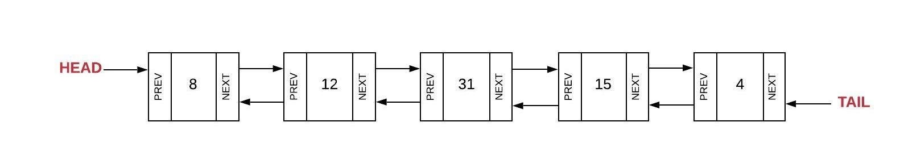
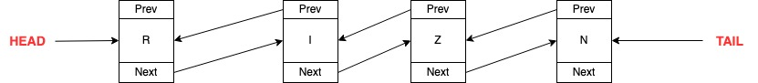
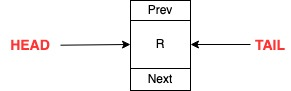
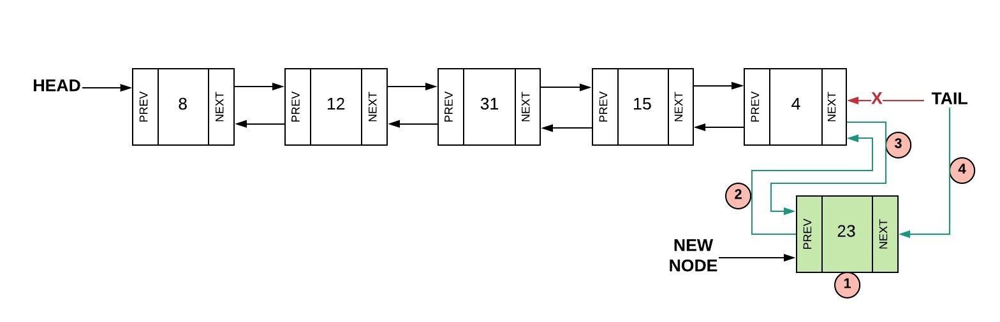
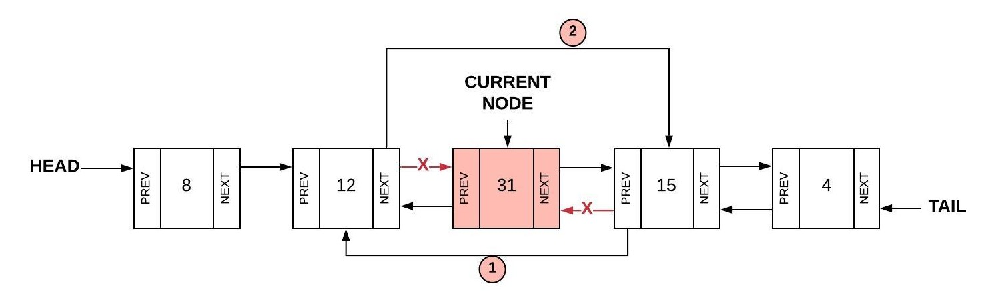

# Linked Lists:

### Table of Contents

Welcome to this linked lists tutorial. Even if you are not familiar with this data structure, you use it all the time
in programming and real life cases. The goal of this tutorial is to help recognize this data structure in your life in
order to solve complex problems.

1. Definition
2. Example
5. Functionality
    1. Push
    2. Pop
    3. Size
9. Coding Challenge
11. Performance
12. Linked lists' don'ts

### Definition

A linked list is defined as the chaining of values. It consists of nodes and links. The nodes are the objects that hold the value and the pointers to 
other nodes in the linked list. The node at the left is the previous node and the node to the right is the next node. 
Each node has a pointer or reference to at least the next node. It is also common to see 
nodes having a reference to the previous node. This allows you to traverse the linked list in both direction(forwards, and backwards). 
    
    Note:
    Python does not have a built in linked list in its standard library like set() and dict().

Unlike other Python data structure, linked lists does not care about the location in memory and the order of each value.
Each node itself knows and keeps track of this for us. The first element is called the **head**, the last element is called the 
**tail**. We will be using both terms because we are gonna study a doubly-linked list.

### Example

A single linked list is the simplest form of this data structure. Each node knows only about the next node and you can 
only traverse it forward.

The following figure helps us understand the concepts of doubly-linked lists described above. 

I would like to use another diagram to illustrate how the connection between nodes is made. 
Feel free to create you own diagram of how you see this connection play out in your brain. Humans
are visual learners and it will help you understand in a simplify way complex concepts.

Notice how each node has a reference to the previous and next value. What we will be doing during this
tutorial is changing the direction of these arrows. 

Even though the linked lists shown in the example hold reference to simple values like integers and strings, 
linked lists can hold reference to other complex values like sets, lists, maps, or other linked lists.

Here is an example of a simple node

        class Node:
        def __init__(self, data):
            self.data = data
            self.next = None
            self.prev = None

### Adding a value:

Inserting a value into a linked list is as simple as changing the direction of the arrows. Let me explain.
We have multiple cases when adding a new element to this data structure.

1. Inserting at the head.
2. Inserting at the tail.
3. Inserting at the middle

#### Inserting at the head

When we insert a new value at the beginning of the list, it becomes the head. This operation is performed
by setting `node.next` to the current head. Setting the `node.prev` of the current head to the new node, and setting the
head to the new node.

If the linked list is empty, we set both the head and the tail to the new `node` and the `node.prev` and `node.next` to `none`; 

#### Inserting the the tail

Inserting a node as the tail follows a similar process to inserting at the head. After we create the new node, the `node.prev`
is set to the current tail. Then we set the `node.next` of the current tail to the newly created node. Finally, we set the 
tail to the new node. 

#### Inserting into the middle

Inserting into the middle is more cumbersome, but it is easy to follow if we focus on the directions of the arrows.
Once we have our node, we set the `node.prev` to the current node. Then we set the `node.next` to the current's node 
`next` node. Now we can set the current's next node's `prev` to the new node. Finally, we set the current node's next
to the new node. 

We can move on to the next section once we understand these concepts.

### Removing values

Removing values or nodes from a linked lists is done simply by braking the links or connection between the node
that we want to remove and the other nodes in the chain.

#### Removing the head

In order to remove the tail we need to  set the `node.prev` of the second node to `none` and set the head
to the second node.

    If the data structured has only one node, set the head and tail to none in order to create an empty linked list.

#### Removing the tail

Removing the tail of a linked list is done by setting the second to last node's `next` to none and setting the tail
to this node.

#### Removing from the middle

Finally, in order to remove a node that is located in the body of the linked list we need to set the `prev` node
after the current to the node before the current. Then, we can the `next` of the node before the current to the node after the current.

##### Pondering

    Take a moment to think about the follwing challenge questions:
    
    1. What events or information in your life can linked list represent?
    2. How would you visit each of the nodes in order(from  head to tail)?
    3. How would you visit eac of the nodes in reverse order(from  tail to head)?

### Coding challenge 

Suppose that you are hired by the CDC to write a  program that will allow scientist to modify the 
genetic sequence of a new virus that is threatening the entire world and humanity. 

You will be using some of the linked list operations we described above. The implementation of the linked
list is provided to you. We want you to be able to use a linked list to solve real complex problems.

Do the following:

1 -  Create a linked list from a genetic sequence stored as a string. Preserve the same order(See inserting at the tail).

      # Solution is already implemented 
      def genetic_sequence_from_string():
        gen_sequence =  "ABCDEFGHIJKLMNOPQRSTUVWXYZ"

        gen_sequence_linked_list = LinkedList()

        for char in gen_sequence:

            gen_sequence_linked_list.insert_tail(char)

        print(gen_sequence_linked_list)

        return gen_sequence_linked_list

2 - Write a function that creates a copy of the linked list. 

      

      # Solution is provided
      def copy_genetic_sequence(original_linked_list):
         new_linked_list = LinkedList()

        current_node = original_linked_list.head

        while current_node is not None:

            new_linked_list.insert_tail(current_node.data)

            current_node = current_node.next

        print("Original sequence:", original_linked_list)

        print("New sequence     :", new_linked_list)

3  - Write a function that creates a sub-linked list from a linked list given a value as marker of the end of the new linked list.

E.g. Given the LinkedList [1, 2, 4, 5, 6, 7, 8, 9, 0] and the marker `6`, your output should be LinkedList [1, 2, 3, 4, 5]

Brainstorm how you would go about solving this and write your solution. Here is a the [sample solution](sample_solution.md).
We can increase the complexity of the problem by setting a param with multiple values and using recursion. 

E.x Passing `469`  would end up generating the following sub-linked lists: [1,2,3] [4, 5] [6, 7, 8].

### Feedback

Please write your solutions to the use case described above and feel free to email them at <alexesca@byui.edu>. Compare
your solution with the example.

### Performance

| Operation      | Big O |  Implementation | 
| ----------- | ----------- | ----------- |
| Append      | O(1)       | .insert_tail(val) |
| Insert   | O(1)        | .insert_head(val) |
| Remove First   | O(1)        |   .remove_head(students_stack) |
| Remove Last   | O(1)        |   .remove_tail(students_stack) |
| Read   | O(n)        |   `for node in ll:`  |
| Replace   | O(n)        |   .replace(a, b)  |

  

### Linked lists' don'ts

1. Do not use linked lists when you need to look up elements by an index quickly. This data structured is ill-suited to work
with algorithms like heapsort.

2. Do not use it to store simple values like strings and booleans. The amount of space allocated just for the data structure is
far greater than its content. Look for more efficient alternatives.

