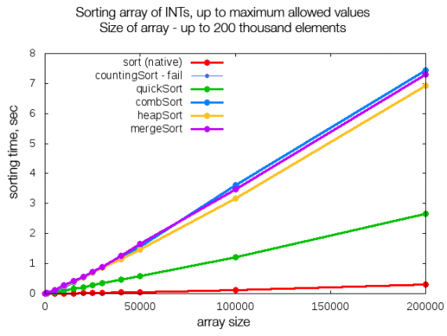
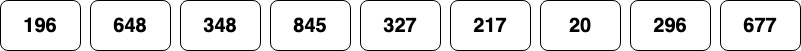
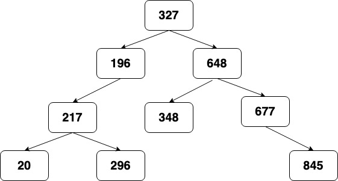
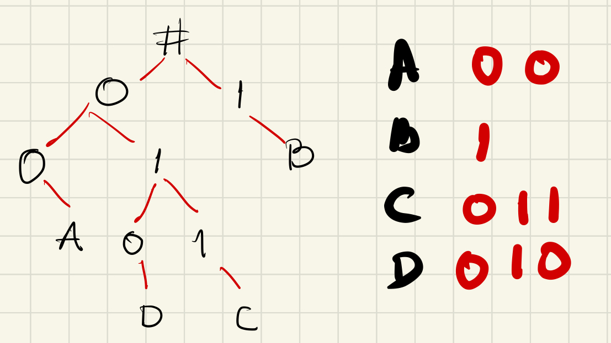

# Binary Trees:

### Table of Contents

Welcome to this binary tree tutorial. Even if you are not familiar with this data structure, you use it all the time
in programming and real life cases. The goal of this tutorial is to help you succeed at coding interviews.

1. Definition
2. Example
5. Functionality
    1. Push
    2. Pop
    3. Size
9. Coding Challenge
10. Coding Challenge
11. Performance

### Definition

We covered linked lists in the previous tutorial. We learned that linked lists consist of nodes and their connections to other
nodes through pointers. Trees also have nodes and pointers connecting other nodes. However, the main 
difference is that a tree node can connect to one or more nodes. The data structure that we will be covering will consist of one parent node and two children nodes since we are reviewing binary trees
    
    Note:
    Python does not have a built in tree data structure in its standard library like set() and dict(). However, you can 
    use tird party module such as bintrees

[bintrees](https://pypi.org/project/bintrees/) external link.

###### Vocabulary definition:

1. Root node:  The root is the topmost node.
2. Leaf node: Node with no other connections.
3. Parent node: A node that has connected nodes. The root node is also a parent node. 
4. Child node: A node that is connected to a parent node. Some child nodes are leaf nodes.

Binary trees can be used to store information that needs to be accessed quickly.

### Binary Search Trees

It is a binary tree that follows rules on how data is stored into the tree. When the new value is greater then the 
parent node, the value is stored in the right node. However, if the value is less than the parent node the data is stored 
in the left node. Storing the data this way helps us have a sorted tree.

We cannot talk about binary trees without mentioning binary search trees. Consider the following chart compering different
sort algorithms with a large dataset. Can you spot the algorithm with binary trees? You are right. It does not seem to be there.
That is because binary tree searches are similar to **quicksort**. The green line in the chart. Notice that when well implemented,
binary search tree algorithms can be faster than other algorithms like merge sort and heapsort. 

### Let’s play!

Lets see the powered of sorted binary trees in action. Below you will find large numbers out of order. Your goal is to 
organize them in the least amount of time and moves possible. Ready... set... go!!!!

Did you finish?  How did it go?

    1. How much time did it take you to sort all the numbers correctly?
    2. How many moves did you have to make?

Now, lets try something else. Try to find a number in the tree. Start at the root or top number. Go left if your number is less than the current number. 
Likewise, go right if your number is greater than the current number. Stop when you find your number.

      1. How much time did it take you to find your number?
      2. How many moves did you have to make to find it? Was it faster?

    
### Recursion

Lets take a moment to discuss about recursion. Recursion is the process of defining itself to perform repetitive tasks until
a base case is reached. This base case prevents the recursion function from running for ever or crashing the machine.

Remember that there is data and processes that can be done recursively. 

An example of recursive data is a binary tree. Evey time you step into a node, you will have to go either left or right.
You can continue to do this until you reach a leaf node or a node with an empty left and right sub-tree. 

An example of recursive processes, actions, or events is calculating the fibonacci numbers. Fibonacci numbers are calculated
by taking the sum of the two previous numbers. This is a perfect candidate for recursion. Other operations involving numbers
can be done recursively. 

Task: Given a number, add up all the even numbers up to that number.

Using a for loop:

      def sum_even_numbers(n):
          count = 0
          for even in range(0, n+1, 2):
              count += even
          return count

Here is a recursion example: 

      # Sum even numbers up to n
      def sum_even_numbers(n):
          # Base case
          if n == 0:
              return 0
          # Sum if even
          if n % 2 == 0:
              return sum_even_numbers(n-2) + n
          # Make it even
          if n % 2 != 0:
              return sum_even_numbers(n-1)
          # Default case
          return 0

### Functionality

Now that you are familiar with binary trees, we can talk about how inserting, removing, and traversing are 
done in binary trees.

#### Inserting a node

Add value to either the left or right subtree. This action also serves as the base case. Then, if the right or left
subtree is empty, the value can be added to the respective node. 

Here is an example of a simple node

        class Node:
        def __init__(self, data):
            self.data = data
            self.next = None
            self.prev = None

#### Traversing the tree

Traversing a binary tree is based on the problem you are trying to solve. For example, if you need to print all the values 
of the tree in ascending order, you start from the root, read the left subtree and then the right subtree. Ad you can imagine, 
printing the values in descending order requires you to read the right subtree first, before printing the values
of the left subtree.

#### Removing a node

The remove operation is done by either setting the left or right subtree to `none` or disconnecting the target node from 
the parent node and any child node. If the tree has only one child, we replace the current node with the current node's 
child node. However, if the node has left and right subtrees, it gets more cumbersome because you need to consider
the position of the current node in the tree. For example, the easiest case scenario would be making the current node's right 
node take place of the current node. The left node could now be the right node of the newly promoted node. 

### Coding Challenge

You have been hired by the BYU-I language department to write a program that stores the alphabet in a binary tree.
You have been given a python dictionary the looks like the following excerpt:

      alphabet = {
        'A': "00",
        'B': "1",
        'C': "011",
        'D': "010",
      }

Your task is to place the key or the symbol at the end of a subtree. The path or the height of the subtree is defined
by the values of the dictionary or binary code. If the code is 0 create a new node and put the code in the left node,
if code is 1 put it in the right node. Repeat these steps until all the codes are exhausted. Once the binary code string
is empty, make the symbol the leaf node. 

At the end of your program, your tree should look like the following figure:

Write your implementation and compare it with the solution found [Here](distribute.md)

### Coding challenge 

The BYU-I math lab hired you to help them develop the next version of their tutoring software. You are tasked with writing
a program that will show all the factors of a given number. You were asked to store these factors in a binary tree. 

Write your implementation and share it with the author of this tutorial and the class. 

Refer to this [File](factorization.md) for the full implementation of the program. 
Compare your solution with the one presented here.
      

### Feedback

Please write your solutions to the use case described above and feel free to email them at <alexesca@byui.edu>. Compare
your solution with the example.

### Performance

| Operation      | Big O |  Implementation | 
| ----------- | ----------- | ----------- |
| Insert   | O(log n)        | .insert(val) |
| Remove    | O(log n)        |   .remove(value) |
| Read   | O(log n)        |   .traverse_forward()  |
| Read backwards   | O(log n)        |   .traverse_backwards()  |
| Contains   | O(log n)        |   .contains(value)  |

